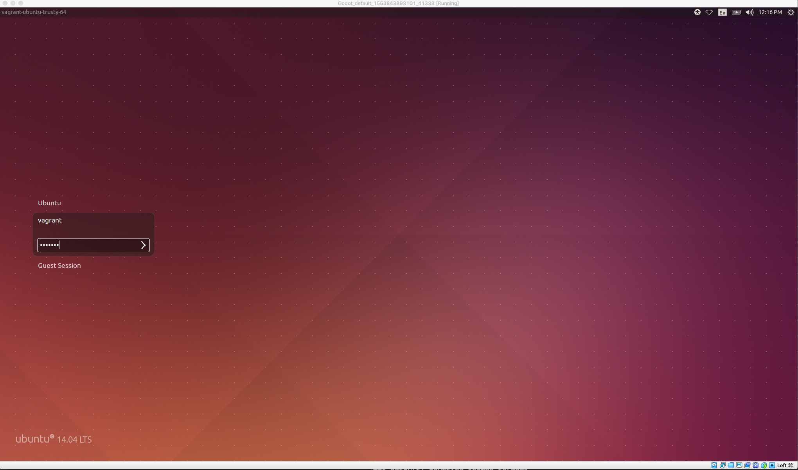
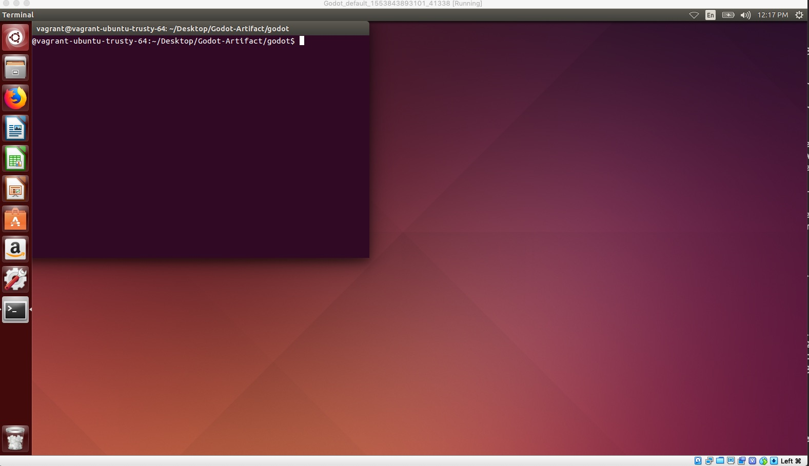

# Godot: Artifact Abstract

<style>
.warning {
    background: beige;
    padding: 10px;
}
</style>

This artifact contains an implementation of data-flow futures in terms of
control-flow futures, in the Scala language. In
the implementation, we show microbenchmarks that solve the three identified
problems in the paper:

1. [*The Type Proliferation Problem* (Section 2, Problems
Inherent in Explicit and Implicit Futures)](assets/submitted-version.pdf#page=4),
2. [*The Fulfilment Observation Problem* (Section 2, Problems
Inherent in Explicit and Implicit Futures)](assets/submitted-version.pdf#page=5), and
3. [*The Future Proliferation Problem* (Section 2, Problems
Inherent in Explicit and Implicit Futures)](assets/submitted-version.pdf#page=4)

This artifact can be seen as an extension to
[Section 5.2. Notes on Implementing Godot](assets/submitted-version.pdf#page=23).
However, it is out of the scope of the artifact to modify the Scala compiler to
perform implicit delegation
([Section 5.1 Avoiding Future Nesting through Implicit Delegation](assets/submitted-version.pdf#page22)),
which allows asynchronous tail-recursive calls to run in
constant space. This can be solved by either using an advanced macro system or
updating the Scala compiler ([Section 5.2. Notes on Implementing Godot](assets/submitted-version.pdf#page=23)).


This artifact shows an implementation of the formal semantics of the paper using
the well-established programming language Scala. The reader can:

- Run the tests by typing `sbt test` (in the `godot` folder), which tests type
  checking rules and runtime semantics described in the paper. This will run 18
  tests that exercise different features of the type system while also checking
  that well-typed programs work as expected.

- Run two microbenchmarks in the form of well-known algorithms
  (*factorial* and *fibonacci*) implemented using the future styles discussed in the
  paper, that highlight the difference between control-flow and data-flow
  futures.

- Run a simulation of a proxy service using control-flow futures parameterised by
  data-flow futures which allows inner data-flow computation to asynchronously
  delegate work to another worker, without mimicking the communication
  structure at the type level, mixing both styles of futures (control- and data-flow futures).

- Read the [Implementation details] section, which explains how data-flow futures
  are integrated in the Scala language, and is aimed at researchers who want to use our
  ideas in implementations of their own, or want to see a concrete example of
  the ideas in the paper integrated in a real programming language.

- Check the mapping of combinators from the formal semantics to the implementation, [*Common API* section (or page 8 from the PDF
  documentation)](#common-api). For example, the paper spawns a task (with a
  future) by calling `async expr`, and the implementation mimics the semantics
  by calling `Future { expr }`.

<!-- - Check the type checking rules. For example, one checks that spawning -->
<!--   control-flow future returns the type `Fut[t]`, as per section 7 (Figure 11) of -->
<!--   the paper.  One can also check that spawning nested data-flow futures returns -->
<!--   a single data-flow future, e.g., spawning nested data-flow as `Flow { Flow { -->
<!--   42 } }` returns a `Flow[Int]`, instead of a `Flow[Flow[Int]]`. -->

- Check the restrictions  of the current implementation (Section [Restrictions](#restrictions)).

<!-- The section Implementation details explains the choices that we did, in plain -->
<!-- English. In the HTML version (at the end of the *Common API* section), we have a -->
<!-- direct link to the implementation, for easy reading. -->

All of these points are outline in the next section.


<!-- To evaluate this artifact, one checks that the microbenchmarks type check -->
<!-- according to the formal semantics from [FutFlow: Primitive Control-Flow Futures -->
<!-- and Encoded Data-Flow Futures](assets/submitted-version.pdf#page=18). -->

(The latest version of the paper can be found [here](assets/submitted-version.pdf))

::: warning ::::::

**NOTE**. We recommend that the reader looks at the HTML version of the `README` file,
since it is better formatted and the links point to PDF sections, automatically.
One can find the HTML version in the downloaded artifact, inside the zip file. If the reader
prefers to read a PDF file, it is still better to download the artifact and read
the instructions included there. It is the same content, but the PDF links will open up
the submitted version of the paper.

::::::::::::::::::::::::

# Description

The paper presents two calculi, one which allows language writers to encode
control-flow futures into a language that has data-flow futures
[(Section 4.2 FlowFut: Primitive Data-Flow Futures and Encoded Control-Flow Futures)](assets/submitted-version.pdf#page=12),
and one that allows current control-flow futures to encode most of the
functionality of data-flow futures
[(Section 4.3 FutFlow: Primitive Control-Flow Futures and Encoded Data-Flow Futures)](assets/submitted-version.pdf#page=17).

This artifact shows how one can encode data-flow futures using control-flow
futures, in the Scala language. There are some implementation details that we cannot encode
directly. These are mentioned in the paper ([Section 5.2 Notes on Implementing
Godot](assets/submitted-version.pdf#page=23)) and explained in this document
(Section [Restrictions](#restrictions)).

Table of Contents:

0. [Folder Structure](#folder-structure)
1. [Prerequisites](#prerequisites) (installation instructions)
   i) [Installing Scala on OSX](#setup-osx)
   ii) [Installing Scala on Linux](#setup-linux)
   iii) [Installing Scala on Windows](#setup-windows)
   iv) [Using a provisioned Virtual Machine](#vm)
2. [Installing Library Dependencies](#installing-library-dependencies)
3. [Implementation in Scala](#Implementation-in-Scala)
   i) [Unit tests],
   ii) [library code],
   iii) [micro-benchmarks],
   iv) [start the REPL to write your own programs](#write-your-own-programs).
4. [Restrictions](#restrictions)

## 0. Folder Structure {#folder-structure}

The folder structure of this artifact is as follows:

```
.
|----- README.html
|----- README.pdf
|----- assets
|       |----- Java8Installation.png
|       |----- fonts
|       |----- pandoc.css
|       |----- submitted-version.pdf
|
|----- godot
        |----- build.sbt
        |----- examples
        |       |----- Microbenchmark.scala
        |       |----- Miscellaneous.scala
        |       |----- ProxyService.scala
        |
        |----- project
        |        |----- build.properties
        |        |----- plugins.sbt
        |
        |----- src
            |----- main
            |       |----- scala
            |               |----- godot
            |                       |----- imperative
            |                               |----- ImperativeFlow.scala
            |----- test
                    |----- scala
                            |----- godot
                                    |----- imperative
                                            |----- AsyncTest.scala
                                            |----- BlockingTest.scala
                                            |----- LiftingTest.scala
                                            |----- MonadicOperations.scala
```

The instructions are in the `README.html` and `README.pdf`. The `assets` folder
contains assets for the HTML version and the submitted paper. If you are reading
the HTML version, the links to the paper direct you to the appropriate page. If
you are using the PDF version, the links only point to the paper. The
implementation can be found under the project folder named `godot`.

## 1. Prerequisites

The library is written in the Scala programming language and has the following dependencies:

- Java 8
- Scala 2.12
- sbt

Below you can find information on how to install these dependencies in [OSX](#setup-osx),
[Linux](#setup-linux) and [Windows](#setup-windows).

### Installing Scala on OSX {#setup-osx}

If you have `brew` installed, just type the following command, which installs
all dependencies:

```bash
brew update
brew install scala sbt
```

If you do not have `brew` installed and you would rather perform a manual installation
process, please follow the [documentation from the official website.](https://www.scala-lang.org/download/)

### Installing Scala on Linux {#setup-linux}

Install Java 8 (JDK) from the command line as follows:

```bash
sudo add-apt-repository ppa:webupd8team/java
sudo apt-get update
sudo apt-get install oracle-java8-installer
```

Download and install `Scala`:

```bash
wget https://downloads.lightbend.com/scala/2.12.8/scala-2.12.8.deb
sudo dpkg -i scala-2.12.8.deb
```

Install `sbt` building tool:^[Command taken from official documentation website: https://www.scala-sbt.org/1.0/docs/Installing-sbt-on-Linux.html]

```bash
echo "deb https://dl.bintray.com/sbt/debian /" | sudo tee -a /etc/apt/sources.list.d/sbt.list
sudo apt-key adv --keyserver hkp://keyserver.ubuntu.com:80 --recv 2EE0EA64E40A89B84B2DF73499E82A75642AC823
sudo apt-get update
sudo apt-get install sbt
```

If you have troubles installing any of the dependencies, I recommend to follow
the installation instructions from [this YouTube video.](https://www.youtube.com/watch?v=uYcSYCGITeU)

### Installing Scala on Windows {#setup-windows}

Visit the [official
website](https://www.oracle.com/technetwork/java/javase/downloads/jdk8-downloads-2133151.html),
click on the radio button *Accept License Agreement*, and download the executable
file for Windows x64, as shown in the image below. Then install the executable.


Install the `sbt` building tool by [clicking in this link](https://piccolo.link/sbt-1.2.8.msi)
and installing the downloaded file `sbt-1.2.8.msi`.

If you have troubles installing Java 8 and Scala, I recommend to follow
the steps from [this YouTube video.](https://www.youtube.com/watch?v=haMI6uoMKs0)

### Using a provisioned Virtual Machine {#vm}

This artifact contains a Virtual Machine (VM) named `Godot-Artifact.ova`.

You can use your favorite virtualisation software. We have tested this VM using
[Virtual Box](https://www.virtualbox.org/).

After importing the VM, start it and login to the VM with the following credentials:

```bash
user: vagrant
password: vagrant
```



Upon login, a terminal will pop up and receive you under the `godot` project folder.



## 2. Installing Library Dependencies

At this step, you should have Java 8, Scala and the sbt building tool installed.
To install the project dependencies, run the following command from inside the
`godot` folder:

```bash
sbt
```

After `sbt` has download all the dependencies, exit the `sbt` program by
typing:^[Every time that you see the use of `sbt <command>`, where `<command>` is
another instruction, it means that you need to exit `sbt` and type that from the terminal,
not from inside the `sbt` program.]

```bash
exit
```

After the dependencies have been installed, you will be able to look at some of
the programs that we can write using data-flow explicit futures, and create
your own programs from the Scala REPL.

## 3. Implementation in Scala {#Implementation-in-Scala}

This section contains the following information:

* the [library code],

* where to find [unit tests],

* [micro-benchmarks],

* start the REPL to [write your own programs](#write-your-own-programs).

### Library Code

The library code can be found in the following folder:

```bash
src/main/scala/godot/imperative/ImperativeFlow.scala
```

The **main contribution** of the implementation is:

- encoding of data-flow futures using control-flow futures,
- the encoding type checks, and lifts concrete values to data-flows (when required)
- no matter how many `asyncS(asyncS(...))` computations the developer spawns, by
  construction, the developer gets a single data-flow future, represented
  by the type `Flow[T]`.

This implementation also shows that:

- To encode the collapsing rule, the **type system needs to be modified**^[This
  affects parametric polymorphism, where the current implementation cannot deal
  with data-flow futures as type variables, explained in the paper [Section 8.2. Notes on
   Implementing Godot](assets/submitted-version.pdf#page=23)],
- since parametric types cannot be parametrized by data-flow futures, a type
  system similar to DeF ([Section 3.2 Data-flow Explicit
  Futures](assets/submitted-version.pdf#page=7)) can easily be implemented in
  Scala.

#### Common API

To make the implementation more natural to the Scala community, we have renamed
some of the functions (methods) from the paper. Below you can find a table with
the assigned name from the paper and the name in the implementation.  All of the
functions have been implemented in the file
`src/main/scala/godot/imperative/ImperativeFlow.scala`, under the singleton
object `Flow`:

[^return]: The `return` keyword needs to be used with care, as describe in a
           blog post from Rob Norris
           [[here](https://tpolecat.github.io/2014/05/09/return.html)],
           [Community Representative from the Scala Center Advisory
           Board](https://www.scala-lang.org/blog/2019/03/18/announcing-new-community-representative.html)

[^lambda-scala]: The Scala notation for functions is not the same as used in the
                 paper. For more information on how to write higher-order
                 functions in Scala, please [visit this
                 link](https://docs.scala-lang.org/tour/higher-order-functions.html#inner-main).

+------------------------------+------------------------------------------------+
| Name in the paper            | Implementation Name                            |
+:============================:+:==============================================:+
|   `async { expr }`           |    `Future { expr }`                           |
+------------------------------+------------------------------------------------+
|   `async* { expr }`          |    `Flow { expr }` or `asyncS { expr }`        |
+------------------------------+------------------------------------------------+
|   `get(e)`                   |    `Await.result(e, 1000.millis)`              |
+------------------------------+------------------------------------------------+
|   `get*(e)`                  |    `getS(e)`                                   |
+------------------------------+------------------------------------------------+
|   `then(e1, e2)`             |    `e1.map(e2)`[^lambda-scala]                 |
+------------------------------+------------------------------------------------+
|   `then*(e1, e2)`            |    `e1.map(e2)`                                |
+------------------------------+------------------------------------------------+
|   `return e`                 |    `return e`[^return]                         |
+------------------------------+------------------------------------------------+
|   $\blacklozenge{}e$         |    `lift(e)`                                   |
+------------------------------+------------------------------------------------+
|   `match(x: e1, x: e2, e3)`  |    `Scala pattern matching`                    |
+------------------------------+------------------------------------------------+
|   `forward e`                |    `NOT IMPLEMENTED` (see [Restrictions, Implicit delegation](#implicit-delegation))      |
+------------------------------+------------------------------------------------+
|   `forward* e`               |    `NOT IMPLEMENTED` (see [Restrictions, Implicit delegation](#implicit-delegation))      |
+------------------------------+------------------------------------------------+

Now, we suggest the reader to look at the implementation code ([found
here](godot/src/main/scala/godot/imperative/ImperativeFlow.scala)) while reading the
implementation details.

#### Implementation details

Data-flow futures have been implemented using a singleton object and trait,
named `Flow`. This is a more object-oriented approach than the calculus from the
paper, but it fits better in the Scala eco-system. We use case classes `Value`
and `Diamond` to extend the `Flow` trait and to encode whether non-future values
are lifted to data-flow futures or whether future values are lifted to flows,
respectively. This encoding allows one to write the following code (which
resembles programming with `Futures` in Scala):

```scala
Flow {  computation()  }.getS
```

One can also allow to stick to the functional notation from the paper, so that
you can write your code as follows:

```scala
getS(  asyncS { computation()  } )
```

The pattern matching from the paper has been encoded using `match` in Scala, and
closely follows the calculus except that we polymorphically dispatch to the
appropriate case class.

The implicit lifting from the paper is encoded using implicit functions in Scala
(functions `liftToFlow`). This implicit lifting, by construction, cannot create
`Flow[Flow[T]]` types, which would be unsound. However, a developer can write a
function that returns `Flow[Flow[T]]` and the implicit lifting will lift twice a value,
creating a mismatch between the type and its runtime representation.
This is also
explained under the [Type collapsing rule, Restrictions section](#type-collapsing-rule).


Finally, there is one point where the implementation differs from the paper,
which has to do with the `R-FlowCompression` [[link to
rule](assets/submitted-version.pdf#page=19)], which affects the encoding of the
`thenS` combinator (named `map` in the implementation). This is due to not being
able to handle implicit delegation ([Section
5.1](assets/submitted-version.pdf#page=22)), discussed in [Section 5.2 Notes on
Implementing Godot](assets\submitted-version.pdf#page=23). More concretely the
deviation is reflected in `flatMap` construct inside the `Diamond` case class
(the `Value` case class presents no issues). The main deviation is that if one
tries to perform

```scala
thenS(flow, fun: T => Flow[T])
```

where the flow is a `Diamond(fut)`, then we perform a future chaining operation
that flattens the returned `Future` (we perform a `flatMap` operation instead of
a `map` operation). If the result of the function application returns a
lifted, non-flow value, we lift it to a Diamond; if it is a lifted
control-flow future, then we just return it.


### Unit tests

The tests are located in:

```bash
src/test/scala/godot/imperative/AsyncTest.scala
src/test/scala/godot/imperative/BlockingTest.scala
src/test/scala/godot/imperative/LiftingTest.scala
src/test/scala/godot/imperative/MonadicOperations.scala
```

To compile and run the tests type the following line from inside the folder `godot`:

```bash
sbt test
```

The output should be similar to this:

```bash
[info] Compiling 1 Scala source to /home/vagrant/Desktop/Godot-Artifact/godot/target/scala-2.12/test-classes ...
[info] Done compiling.
[debug] Test run started
[debug] Test godot.imperative.LiftingTest.testLiftingFutureValueReturnsFlow started
[debug] Test godot.imperative.LiftingTest.testLiftingFutureValueReturnsFlow finished, took 0.003 sec
[debug] Test godot.imperative.LiftingTest.testLiftingAFutFlowReturnsASingleFlow started
[debug] Test godot.imperative.LiftingTest.testLiftingAFutFlowReturnsASingleFlow finished, took 0.007 sec
[debug] Test godot.imperative.LiftingTest.testImplicitLiftingOfFutureValueToFlow started
[debug] Test godot.imperative.LiftingTest.testImplicitLiftingOfFutureValueToFlow finished, took 0.001 sec
[debug] Test godot.imperative.LiftingTest.testImplicitLiftingOfValueToFlow started
[debug] Test godot.imperative.LiftingTest.testImplicitLiftingOfValueToFlow finished, took 0.0 sec
[info] ScalaTest
...
[info] Passed: Total 18, Failed 0, Errors 0, Passed 18
[success] Total time: 1 s, completed Mar 25, 2019 8:48:04 PM
```

### Micro-benchmarks

There are a limited number of microbenchmarks:

* [Microbenchmarks] (in [`godot/examples/Microbenchmarks.scala`](godot/examples/Microbenchmarks.scala))
* [Proxy Service] (in [`godot/examples/ProxyService.scala`](godot/examples/ProxyService.scala))
* [Miscellaneous] (in [`godot/examples/Miscellaneous.scala`](godot/examples/Miscellaneous.scala))


Each microbenchmark section contains an short explanation and identifies
which problems it solves.

#### Microbenchmarks

There are two microbenchmarks, [factorial] and [fibonacci].

##### Factorial

An asynchronous tail-recursive function for calculating the factorial of a
number cannot be typed unless the developer introduces constructs that remove
the nested of futures, such as the blocking (`get`) or awaiting (`Await.ready`)
operations. Furthermore, the developer needs to explicit lift a value to a
future, so that there is a uniform return type. For example, one can type the
factorial function using `Futures` as follows.

[Click here to see the raw code.](godot/examples/Microbenchmark.scala)

```scala
import scala.concurrent.ExecutionContext.Implicits.global
import scala.concurrent.duration._
import scala.concurrent.{Await, Future}

// Alternative 1
def factorialFuture(n: Int, accumulator: Int): Future[Int] = {
  if (n == 1) Future.successful(accumulator)
  else {
    val result = factorialFuture(n - 1, n * accumulator)
    val finalResult = Await.result(result, 1000.millis)
    Future.successful(finalResult)
  }
}
```

There is a second alternative, which requires the explicit
introduction of `flatMap` in each iteration, so that it can flatten the nested
future into a single future.

```scala
// Alternative 2
def factorialFutureAlt(n: Int, accumulator: Int): Future[Int] = {
  if (n == 1) Future.successful(accumulator)
  else Future(factorialFutureAlt(n - 1, n * accumulator)).flatMap(identity _)
}
```

With the usage of data-flow futures, the function can be written as follows:

```scala
import godot.imperative._
import godot.imperative.Flow._
import scala.concurrent.ExecutionContext.Implicits.global
import scala.concurrent.duration._
import scala.concurrent.{Await, Future}

def factorial(n: Int, accumulator: Int): Flow[Int] = {
    if (n == 1) accumulator
    else asyncS(factorial(n - 1, n * accumulator))
}
```

The `if` branch automatically lifts the `accumulator` to a `Flow[Int]` and the
`else` branch flattens immediately the possible nested `Flow[Flow[Int]]`.

With the use of data-flow futures, we tackle the [*The Type Proliferation
Problem* (Section 4.4, Integrating Data-Flow and Control-Flow Futures and
Delegation)](assets/submitted-version.pdf#page=20), as the data-flow futures
hide their internal communication structure, and [*The Future Proliferation
Problem* (Section 4.4, Integrating Data-Flow and Control-Flow Futures and
Delegation)](assets/submitted-version.pdf#page=20), as the data-flow future
structure guarantees that there will be no *falsely fulfilled* future.^[This
implementation partly solves *The Future Proliferation Problem*, as it solves
*falsely fulfilling* a future but does not introduce the *forward* nor runs in
constant space. As mentioned before, this requires the use of an advanced macro
system or updating the Scala compiler, which is outside of the scope of the
artifact.]

To test this program, follow the instructions from the Section [Test existing programs].

#### Fibonacci

The Fibonacci code follows the same pattern and can be found in the same file
as the factorial example.

[Click here to see the raw code.](godot/examples/Microbenchmark.scala)

#### Proxy Service

This program is similar to the one explained in the paper, simulating the work
of actors, using tasks instead.  The `Main` class is the main entry point. It
creates a load balancer and "sends" messages to it, returning immediately
control-flow futures containing data-flow futures, i.e., `Future[Flow[T]]`.  The
outermost future denotes whether the load balancer has found an idle worker and
successfully delegated the job; the innermost (data-flow) future denotes the
result of `run(job)`. To make things simple, we will just send jobs to idle
workers, map on the (control-flow) futures to get to their inner (data-flow) futures
and sum all their results, until we have a final single value.

```scala
class Main extends App {
  var list = new ListBuffer[Future[Flow[Int]]]()
  val proxy = new LoadBalancer()
  val listOfFlows = for (i <- 0 until 1000) {
    list += proxy.run(new Computation())
  }
  val flowList = list.map(Await.result(_, 1000.millis))
  val actual = flowList.foldLeft(0)(_ + _.getS)
  println(s"Running the sum of the asynchronous jobs: ${actual}  (check result = ${42 * 1000})\n\n")
}
```

The message (class `Computation`) is a ``costly'' computation:

```scala
// Costly computation
class Computation {
  def start(): Int = 42
}
```

The load balancer passes the work to a worker thread and returns the handle to
this work, a control-flow future (highlighted in light blue^[Not shown in the pdf version]).

<style>
#cb15-8 { background: lightblue }
</style>

```{.scala}
class LoadBalancer() {
  val workers = List(new Worker(), new Worker(), new Worker(), new Worker())
  val turn = new AtomicInteger(0)

  def run(job: Computation): Future[Flow[Int]] = {
    val currentTurn = turn.get()
    turn.weakCompareAndSet(currentTurn, (currentTurn + 1) % workers.size)
    Future(this.workers(currentTurn).run(job))
  }
}

class Worker(){
  def run(job: Computation): Flow[Int] = asyncS { job.start() }
}
```

With the use of data-flow futures, we tackle the [*The Type Proliferation
Problem*, as the data-flow futures hide their internal communication structure,
and *The Fulfilment Observation Problem*, as it allows to observe the current
stage of futures computations, when necessary (Section 4.4, Integrating Data-Flow and Control-Flow
Futures and Delegation)](assets/submitted-version.pdf#page=20)


If we were to use control-flow futures, instead of data-flow futures, the
communication with the load balancer creates a future, which contains a nested
future, the one that the load balancer produces when it communicates with the
worker thread; the return type would be `Future[Future[Int]]`. Any further
asynchronous call would be reflected in the types.

```scala
asyncS{ proxy.run(new Computation) } :: Future[Future[Int]]
```

To test this program, follow the instructions from the Section [Test existing programs].
(This program reproduces these instructions when it is executed, so that the
reader does not need to go back and forth between the documentation and the terminal.)

[Click here to see the raw code.](godot/examples/ProxyService.scala)

#### Miscellaneous

Data-flow futures defined the common `map` and `flatMap` operations. This allows developers to use the
common for-comprehension notation. One simple example, taken from
[`godot/examples/Miscellaneous.scala`](godot/examples/Miscellaneous.scala):

```scala
val flow = for {
    flowInt <- asyncS { 42 }
    flowString <- flowInt.map(_.toString())
} yield flowString
```

Use this example as inspiration for [writing your own programs](#write-your-own-program).

### Start the REPL to write your own programs {#write-your-own-programs}

There are two ways to play with the library:

1. [Test existing programs]
2. [Write your own program]

#### Test existing programs

From the `godot` project folder, fire up the REPL:

```bash
sbt console
```

inside the `godot` folder. Start typing:

```bash
:load examples
```

and press the TAB button two times, so that it autocompletes the full-path to
the examples library, which in my case is:

```bash
/home/vagrant/Desktop/Godot-Artifact/godot/examples/
```

Then choose a file to load. In this case, lets play with the `ProxyService.scala`:

```bash
:load /home/vagrant/Desktop/Godot-Artifact/godot/examples/ProxyService.scala
```

This will print something similar to:

```bash
Loading /home/vagrant/Desktop/Godot-Artifact/godot/examples/ProxyService.scala...
import java.util.concurrent.atomic.AtomicInteger
import godot.imperative._
import godot.imperative.Flow._
import scala.collection.mutable.ListBuffer
import scala.concurrent.ExecutionContext.Implicits.global
import scala.concurrent.Promise
defined class Computation
defined trait Runnable
defined class Worker
defined class LoadBalancer
defined class Main
```

Run the example by typing:

```bash
Main.main(Array())
```

#### Write your own program

From the `godot` project folder, fire up the REPL:

```bash
sbt console
```

Now you need to import the libraries dependencies

```bash
// Load data-flow library
import godot.imperative._
import godot.imperative.Flowing._

// Load Execution Context and Future library
import scala.concurrent.ExecutionContext.Implicits.global
import scala.concurrent._
```

From this point on, you can write your own programs, e.g.:

```
// Fire up an asynchronous computation
val f = asyncS(34)
```

## 4. [Restrictions]{#restrictions}

This implementation mimicks the semantics of the paper, even when this may not
be the most efficient implementation. There are two things that this implementation
cannot handle:

1. [Implicit delegation]{#implicit-delegation}

   As mentioned in the paper [Section 5.1](assets/submitted-version.pdf#page=22), implicit
   delegation is not easy to add without introducing new abstractions -- which
   adds overhead -- or changing the compiler (mentioned in [last paragraph of
   Section 5.2. Notes on Implementing
   Godot](assets/submitted-version.pdf#page=23))

    Example:

   ```scala
   def test(): Flow[Int] = {
     asyncS {
       asyncS { 42 }
     }
   }
   ```

   The `asyncS` construct creates a promise that could
   be passed to the inner `asyncS`, so that we avoid the creation of two
   promises.

2. [Type collapsing rule]{#type-collapsing-rule}[^type-collapsing]

   [^type-collapsing]: [In the paper, this is stated as follows](assets/submitted-version.pdf#page=23):

       > In the other direction, it is slightly more involved as the type system
       > of the control-flow future language must implement a form of type
       > collapse rule.

   By construction, the library will not create a `Flow[Flow[T]]`. However,
   the implicit lifting can be tricked by a developer to nest data-flow futures,
   e.g.:

   ```scala
   def id(x: Flow[T]): Flow[Flow[T]] = x
   ```

   This function returns a nested data-flow, but its runtime representation
   cannot capture this fact -- it is non-sensical for data-flow futures to have
   nested data-flow futures. To completely rule out this situation, one would
   need to modify the compiler to forbid this ([Section 5.2. Notes on
   Implementing Godot](assets/submitted-version.pdf#page=23)).
